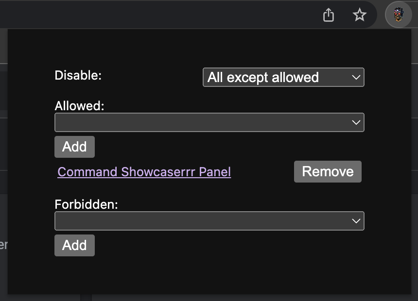
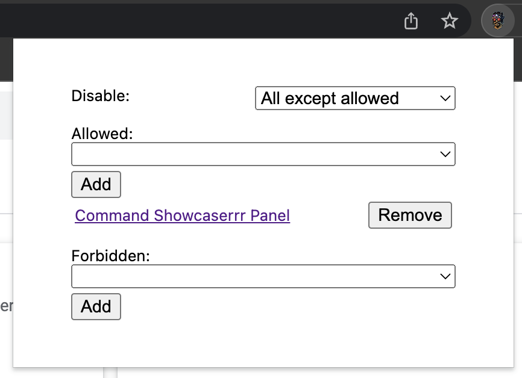
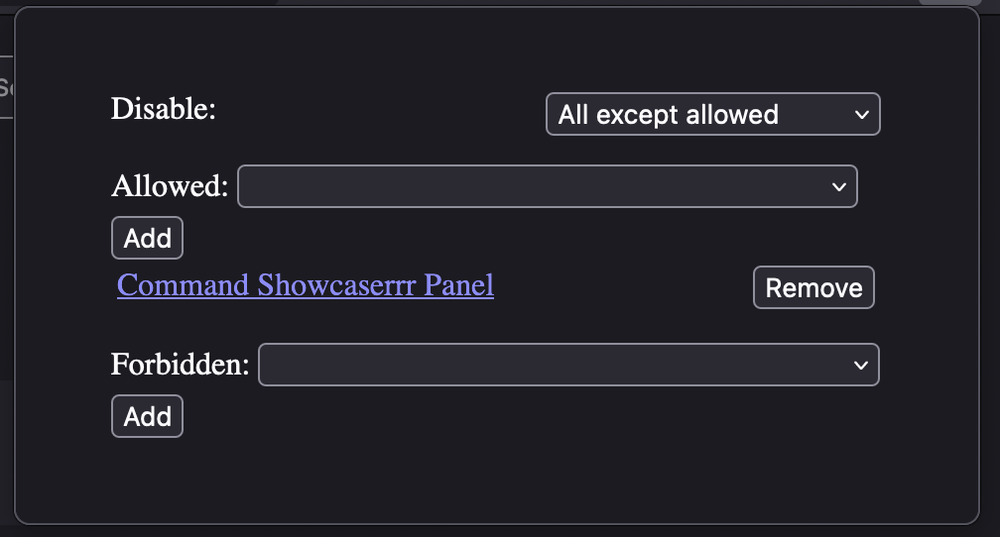

# disable-twitch-extensions

Fork of [CommanderRoot/disable-twitch-extensions](https://github.com/CommanderRoot/disable-twitch-extensions).

## Changes from fork

14 Apr 2023:

- Added dark mode
- Adjusted layout
- Changed icon to something more Twitch-themed

## Screenshots

### Chrome

### Firefox

